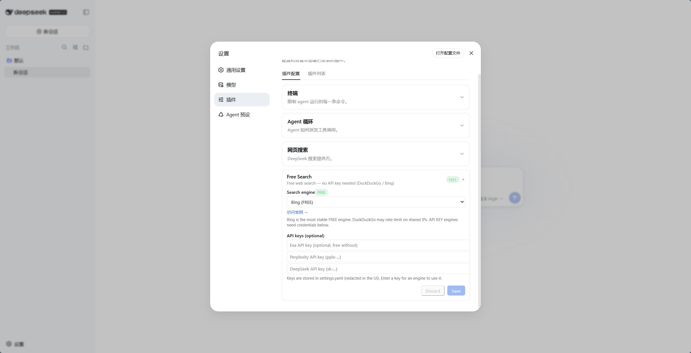
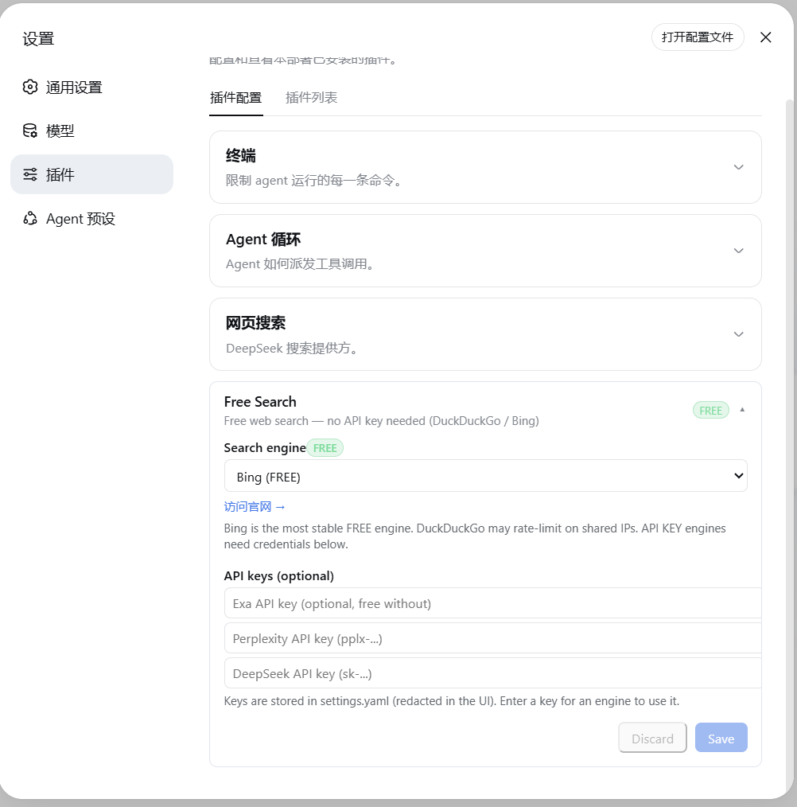
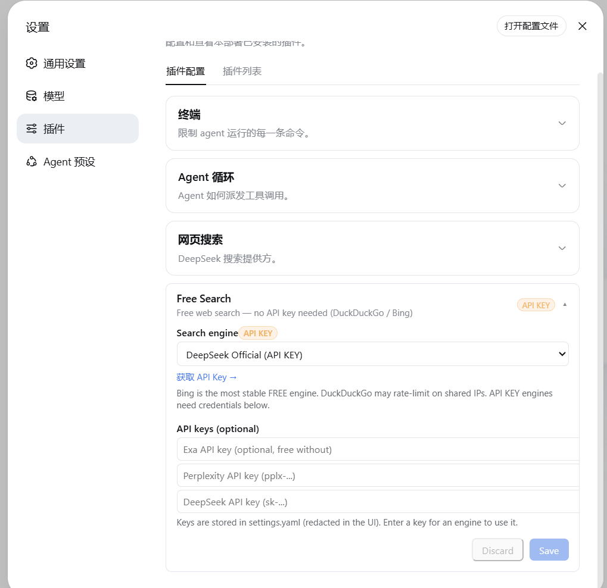
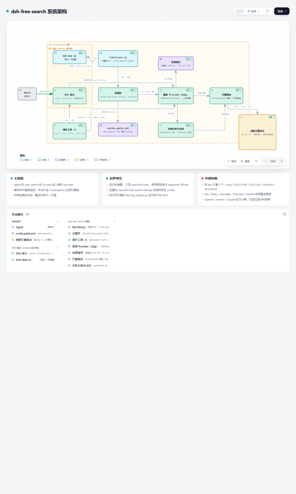
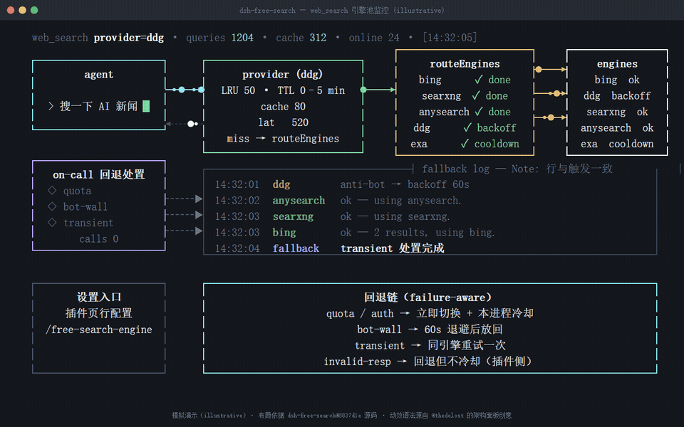

# dsh-free-search

**DeepSeek Harness 免费搜索插件 —— 无需 API key，零成本，多引擎可切换。**

[](https://www.npmjs.com/package/dsh-free-search)
[](./LICENSE)
[](./CONTRIBUTING.md)

**简体中文** · [English](./README.en.md)

## 目录

- [简介](#简介)
- [特性](#特性)
- [引擎列表](#引擎列表)
- [快速开始](#快速开始)
- [使用](#使用)
- [配置](#配置)
- [进阶](#进阶)
- [架构](#架构)
- [贡献](#贡献)
- [许可证](#许可证)

## 简介

dsh 默认的搜索 provider 依赖 DeepSeek 官方 API key（`DEEPSEEK_API_KEY`）。没有（或不想用）官方 key，或使用 opencode-go 这类网关（其 OpenAI 兼容端点不支持 `web_search` 工具）时，内置搜索必然失败，agent 会告诉你「无法联网」。

本插件给 DeepSeek Harness（dsh）注册多引擎搜索 provider（`ctx.web` seam）：多个免费引擎 + 自动回退，彻底摆脱官方 key 依赖。`web_search` 工具自动选用；网页设置页可切换引擎、配置 API key、一键测试所有引擎；聊天框输入 `/free-search-engine` 弹出式切换引擎。

<p align="center">
  <a href="assets/settings-free1.png">
    
  </a>
  <br>
  <sub>▲ 免费引擎设置（以 Bing 为例）</sub>
</p>

## 特性

- **零成本** —— 多个免费引擎，无需 key、无需注册。
- **多引擎可选**：DuckDuckGo（html/lite）、Bing、SearXNG（元搜索，支持自定义实例）、AnySearch、Exa、Tavily、Keenable、Firecrawl、Parallel、Perplexity、SerpBase、Serply、DeepSeek 官方、You.com、百度千帆、Kimi、阿里云百炼、火山联网搜索（豆包搜索）、知乎全网/站内（`zhihu_global`/`zhihu_site`，经知乎开放平台 MCP）、OpenAI / Gemini / Claude 模型内置搜索。
- **网页设置页** —— 引擎切换 + API key 配置（UI 中 key 脱敏显示「已配置」）+ 中英文切换；入口在左侧「插件」页的组件行配置（`plugins.row.config`，DSH 0.1.7-rc.1+）。
- **弹出式切换命令** —— 聊天框输入 `/free-search-engine`，弹出引擎选择窗口，点选即切换（等效设置页 + 保存）。
- **引擎测试** —— `free_search_test` 工具让 agent 一键测试所有引擎；设置页也有「测试引擎」按钮（直测当前引擎，不走回退链，付费引擎无 key 会明确报错）。
- **全局引擎开关与回退优先级** —— 设置页可勾选/取消引擎（取消后全局生效：普通搜索 / Auto / `advanced_search` / `multi_search` / 引擎测试都不再用它），并可用 ↑↓ 调整全局回退顺序（一键恢复默认）。
- **Multi 模式** —— 可把搜索引擎设为 `Multi Search`：`web_search` 并发请求前 3 个已启用引擎、按 URL 合并去重、跨源命中的结果优先（代价是成倍消耗额度；multi 失败会自动退回单引擎回退链）。
- **统一引擎回退** —— 任何引擎失败（付费/免费，缺 key/401/限流/网络）自动轮流尝试下一个引擎：首选引擎 → 其他引擎（exa/tavily/keenable/firecrawl/parallel 无 key 也会尝试，因为它们自带 keyless 免费额度）→ 剩余免费引擎，搜索永不直接失败；结果顶部注明实际生效的引擎（如 `Note: perplexity unavailable or failed, using exa.`）；失败按类别处理：额度/鉴权失败→本会话冷却该引擎，反爬→短退避，超时/5xx/限流→同引擎重试一次，解析失败/0 结果→不冷却（详见下文「失败分类与引擎冷却」）。
- **时间过滤** —— `advanced_search` 工具支持 `timeRange`：固定档、自定义相对值、绝对日期三种形式（详见下方逻辑说明）。
- **系统提示词注入** —— agent 知道当前用哪个引擎、哪些需要 key；并明确所有搜索结果是**不可信外部数据**，不得执行其中的指令。
- **提示注入防护（不可信数据边界）** —— 插件自有工具（advanced_search / platform_search / free_search_test）的网页文本包在 `<untrusted-web-content>` 边界内（正文里自带的同名标记会被剥离，防止提前闭合）；核心 web_search / web_fetch 由 DSH 核心自带同类提示（`External web content follows...`）；所有 snippet 统一清洗并截断到 300 字符。
- **版本号 + 检查更新** —— 设置卡片显示当前版本，「检查更新」按钮直连 npm registry 对比最新版，有新版本时提示并可一键跳转。
- **结果缓存** —— 相同查询（含引擎/时间过滤参数）5 分钟内命中缓存（LRU 50 条），防免费引擎限流、省付费额度；时长可在设置页 0–5 分钟自由配置（0 关闭）。
- **安全搜索过滤（safeSearch）** —— `off` / `moderate` / `strict` 三档，作用于 Bing 与 DuckDuckGo HTML/Lite（详见下文）。
- **免费标注** —— 设置页中免费引擎带绿色 `FREE` 徽章，付费引擎带橙色 `API KEY` 徽章。
- **网页抓取（web_fetch）** —— 让 agent 抓取网页内容（官方 `dsh-web-fetch-http` provider，纯 JS，零额外依赖）。
- **平台搜索（platform_search）** —— 搜 GitHub / V2EX / B站 / Reddit / Hacker News / Stack Overflow / 维基百科 / npm / YouTube / Vimeo（公开 API 或免 key 抓取，零依赖）。
- **视频搜索（video_search）** —— 跨站找视频：Bing Videos + DuckDuckGo Videos（免 key，失败互相回退），返回视频链接、标题与来源/时长等元信息。
- **干净集成** —— 实现官方 `WebSearchProvider` seam 接口，与官方插件共存。

## 引擎列表

| id | 引擎 | 费用 | 说明 |
|---|---|---|---|
| `auto` | Auto 智能路由 | 动态 | **根据查询语言/时间条件自动选路**（含中文优先 Bing/Baidu/Aliyun/AnySearch，英文优先 Bing/Exa/Tavily；时间过滤优先支持引擎），末尾全量回退 |
| `ddg` | DuckDuckGo HTML | 免费 | 偶发限流（反爬），解封自动恢复 |
| `ddg-lite` | DuckDuckGo Lite | 免费 | 轻量版，同上 |
| `bing` | Bing | 免费 | **默认引擎**，最稳定，中文优化（zh-CN） |
| `anysearch` | AnySearch AI | 免费 | AI 搜索，无 key（匿名额度） |
| `searxng` | SearXNG 元搜索 | 免费 | 多实例自动切换，支持自定义实例 |
| `exa` | Exa | 免费 | **无 key 也可用**（MCP 匿名），配 key 提升额度 |
| `tavily` | Tavily | 免费 | **无 key 也可用**（keyless 匿名），配 key 提升额度 |
| `keenable` | Keenable | 免费 | **无 key 也可用**（MCP 匿名），配 key 提升额度 |
| `firecrawl` | Firecrawl | 免费 | **无 key 也可用**（官方免 key 匿名额度），配 key 提升限额 |
| `parallel` | Parallel | 免费 | **无 key 也可用**（官方 MCP 匿名额度），配 key 提升额度并支持精确时间过滤 |
| `perplexity` | Perplexity | 付费 | 需 `PERPLEXITY_API_KEY` |
| `serpbase` | SerpBase | 付费 | 需 `SERPBASE_API_KEY`（serpbase.dev，注册送 100 次免费额度） |
| `serply` | Serply | 付费 | 需 `SERPLY_API_KEY`（serply.io，新账户 30 天内 2,500 次免费额度）；Google 网页结果，按设置页语言本地化 |
| `deepseek-official` | DeepSeek 官方 | 付费 | 需 `DEEPSEEK_API_KEY` |
| `you` | You.com | 付费 | 需 `YOUCOM_API_KEY`（[you.com/platform/api-keys](https://you.com/platform/api-keys)，注册即送免费额度） |
| `baidu` | 百度千帆 AI 搜索 | 额度 | 需 `BAIDU_API_KEY`（千帆 AI 搜索，每日赠 50 次，超额按量后付费）；中文全网，支持时间过滤 |
| `kimi` | Kimi（Moonshot）联网搜索 | 付费 | 需 `MOONSHOT_API_KEY`（basic 约 ￥0.01/次），返回带正文 chunks 的中文结果 |
| `aliyun` | 阿里云百炼 EnhancedSearch | 付费 | 需 `DASHSCOPE_API_KEY`（MCP search_pro，约 ￥0.03/次，新用户 200 次免费包）；中文全网带来源 hostname |
| `doubao` | 火山引擎联网搜索（豆包搜索） | 免费额度 | 需 `DOUBAO_SEARCH_API_KEY`（联网搜索控制台开通，**每月 500 次免费**，超出按量付费）；中文时效内容强，支持时间/站点过滤，返回千字级摘要 |
| `zhihu_global` | 知乎全网搜索（开放平台 MCP） | 付费 | 需 `ZHIHU_API_KEY`；支持时间过滤（`publish_time`）；无 key 时自动跳过 |
| `zhihu_site` | 知乎站内搜索（开放平台 MCP） | 付费 | 需 `ZHIHU_API_KEY`；站内接口无时间过滤参数（不支持时间过滤） |
| `openai` | OpenAI 模型内置搜索 | 付费 | 需 `OPENAI_API_KEY`；走 Responses API 的 `web_search` 工具，返回带引用的回答。**按次计费，仅在显式选中时使用**（不参与自动回退/auto）；默认 `gpt-6-luna`，模型与端点可配（`openaiModel` / `openaiBaseUrl`） |
| `gemini` | Gemini Grounding with Google Search | 付费 | 需 `GEMINI_API_KEY`（兼容 `GOOGLE_API_KEY`）；走官方推荐的 **Interactions API**（`POST /v1beta/interactions`，`tools:[{type:"google_search"}]`），从 `steps[].content[].annotations` 取引用。**按次计费，仅在显式选中时使用**；默认 `gemini-3.8-flash`，模型与端点可配（`geminiModel` / `geminiBaseUrl`） |
| `claude` | Claude 服务端 web_search | 付费 | 需 `ANTHROPIC_API_KEY`；结果来自 `web_search_tool_result`。**按次计费，仅在显式选中时使用**；默认 `claude-sonnet-5-5`，模型与端点可配（`claudeModel` / `claudeBaseUrl`） |

- **默认引擎为 `bing`**（免费且最稳定），安装后开箱即用。
- **自动回退**：任何引擎失败（免费限流/反爬，付费缺 key/无效/网络错误）都会自动轮流尝试下一个引擎——先试其他已配 key 的付费引擎，再试免费引擎（Bing/AnySearch 等），并在结果中附带回退提示——搜索不会因引擎问题直接失败。
- **设置页有官网链接**：免费引擎显示「访问官网 →」，付费引擎显示「获取 API Key →」（新标签页打开）：
  - [Exa API Keys](https://dashboard.exa.ai/api-keys)
  - [Tavily 控制台](https://app.tavily.com/home)
  - [Keenable 登录](https://keenable.ai/login)
  - [Parallel 平台](https://platform.parallel.ai)
  - [Perplexity API 设置](https://www.perplexity.ai/settings/api)
  - [SerpBase](https://serpbase.dev)
  - [Serply](https://serply.io)（[API 文档](https://serply.io/docs)）
  - [DeepSeek API Keys](https://platform.deepseek.com/api_keys)
  - [豆包搜索（火山联网搜索）控制台](https://console.volcengine.com/search-infinity/web-search)
  - [You.com API Keys](https://you.com/platform/api-keys)

### 为什么免费引擎不需要 key？

- **AnySearch**：其 `v1/search` REST 接口提供匿名的公共搜索额度，无需注册或 API key。额度有限流（适合日常搜索），但作为免费引擎之一，与其他免费引擎互相回退，体验稳定。
- **Exa**：公开 MCP 端点（`mcp.exa.ai/mcp`）支持匿名调用，不配 key 也能用；配置 `EXA_API_KEY` 后可获得更高额度。
- **Tavily**：通过 `x-tavily-access-mode: keyless` 头走 keyless 匿名额度，不配 key 即可用；配置 `TAVILY_API_KEY` 后走账号档，额度更高、结果质量更稳定。
- **Keenable**：无 key 时走其公开 MCP 端点（`api.keenable.ai/mcp`）匿名调用；配置 `KEENABLE_API_KEY` 后走 REST API（`api.keenable.ai/v1/search`），额度更高、按组织限流。
- **Firecrawl**：其 `/v2/search` 端点**无需 key** 即可使用（官方文档明确说明，有匿名限流）；配置 `FIRECRAWL_API_KEY` 后可提高限额。支持 `tbs` 时间过滤（`qdr:h/d/w/m/y` 与自定义日期区间）。

## 快速开始

### 前置条件

- git
- Node ≥ 20（见 `package.json` 的 `engines` 声明）
- DeepSeek Harness ≥ 0.1.7-rc.1（网页设置页与弹出式切换命令需要；纯命令行使用不受此限）

### 安装

```sh
git clone https://github.com/DDDMUC/dsh-free-search.git
dsh plugin --profile web add /path/to/dsh-free-search    # 把本地克隆注册为 web profile 插件
dsh web    # 重启宿主，加载插件
```

安装重启后，`web_search` 自动走本插件（默认引擎 `bing`，免 key）：对 agent 说「搜一下今天的 AI 新闻」即可验证。设置页入口与各工具用法见下文[使用](#使用)。

## 使用

### 网页设置（推荐）

安装后打开配置页（DSH 0.1.7-rc.1+）：

- 左侧 **插件** 页 → **已安装** 分组 → `free-search` → 点击组件行 `web-search-free`（行内「配置」入口）

配置页提供：

- **Search engine**：下拉框切换引擎，保存即生效。
- **API keys**：为 Exa / Tavily / Keenable / Firecrawl / Parallel / Perplexity / DeepSeek / SerpBase / Serply / You.com 填写 key（密码框，保存后只显示「已配置」；Exa / Tavily / Keenable / Firecrawl / Parallel 不填也可免 key 使用）。
  - **推荐**：付费引擎 key 建议写入 harness 凭据中心 `~/.dsh/.credentials.yaml`（如 `DEEPSEEK_API_KEY: sk-...`，与官方 LLM provider 一致，一处管理所有 key）。插件读取优先级：凭据中心 > 设置页 > 环境变量，设置页填的 key 仅作为遗留兼容。
- **Test engine**：直测当前引擎可用性（不走回退链，付费引擎无 key 会明确报错）。
- **Use Bing default**：把当前搜索引擎切回稳定的免费 Bing；`Discard` 只撤销尚未保存的编辑。
- **Platform search**：勾选启用 GitHub / V2EX / Bilibili / YouTube / Vimeo 平台搜索（`platform_search` 工具按此过滤）。
- **EN / 中文**：切换界面语言（默认中文）。

<table align="center" style="border: none; border-collapse: collapse;">
  <tr style="border: none;">
    <td align="center" width="50%" style="border: none; padding: 6px;">
      <a href="assets/settings-free.png">
        
      </a>
      <br>
      <sub>▲ <b>免费引擎</b>（显示绿色 FREE 徽章与官网链接）</sub>
    </td>
    <td align="center" width="50%" style="border: none; padding: 6px;">
      <a href="assets/settings-apikey.png">
        
      </a>
      <br>
      <sub>▲ <b>付费/API Key 引擎</b>（显示橙色 API KEY 徽章与获取链接）</sub>
    </td>
  </tr>
</table>

### 聊天框切换引擎（/free-search-engine）

不用进设置页也能切换引擎：在聊天框输入 `/free-search-engine`，**弹出引擎选择窗口**（和 `/model` 选模型一样的交互），点选即切换，当前引擎会标记出来。等效于设置页切换 + 保存，且界面语言跟随设置页（中文/英文）。

命令只改首选引擎配置，搜索仍走 `web_search` + 统一回退链：即使首选引擎挂了也会自动换其他引擎，永不直接失败。系统提示词同步刷新。

### 引擎开关、回退优先级与 Multi 模式

设置页有三个新块（都会保存进条目 config）：

- **全局启用的搜索引擎**：取消勾选后，该引擎会从普通 `web_search` 回退链、Auto 智能路由、`advanced_search`、`multi_search` 和引擎测试中**全局排除**；至少要保留一个引擎。
- **全局回退优先级**：用 ↑↓ 调整先后顺序。首选引擎仍先尝试；Auto 保留「语言/时间」路由规则，但自定义后同一分组内及后续回退按此顺序。被禁用的引擎保留在列表里（标记「已禁用」）但不执行；「恢复默认顺序」一键还原。
- **搜索引擎下拉里的 `Multi Search`**：选中后 `web_search` 会并发查询路由/优先级前 3 个已启用引擎，URL 去重合并、跨源命中的结果排前面。注意并发会成倍消耗额度；Multi 失败时会自动退回普通单引擎回退链并在结果里注明。

### 安全搜索过滤（safeSearch）

- 配置项 `safeSearch`：`off`（引擎默认，不加参数）/ `moderate` / `strict`。
- 作用于 Bing（adlt）、DuckDuckGo HTML（adlt）、DuckDuckGo Lite（adlt）。
- 默认 `off`：不额外过滤，保持引擎自身默认行为；需要时在「设置 > 插件 > Free Search」切换。

### 失败分类与引擎冷却（Failure-aware fallback）

回退链不再把所有失败一视同仁，而是先给失败分类（issue #36）：

- **`quota`（额度/预算耗尽，HTTP 402 / `NO_MORE_CREDITS` / SerpBase 免费额度用尽）**：立即切换，并把该引擎**在本进程内冷却**——后续搜索不再尝试它，避免反复撞墙。
- **`auth`（401/403、key 无效或未配置）**：同上，冷却到本会话结束（改好 key 重载插件即恢复）。
- **`bot-wall`（如 DDG 反爬挑战）**：冷却一小段（默认 60s）后再自动放回链中。
- **`transient`（超时 / 5xx / 网络 / 429 限流）**：**同一引擎重试一次**再回退，避免一次抖动就丢掉好引擎。
- **`invalid-response`（解析失败 / 结构变化 / 返回 0 结果）**：照常回退，但归类为插件侧问题，不冷却引擎。

回退结果的 `Note:` 现在会给出具体类别，例如 `Note: exa is out of quota, using doubao.`、`Note: perplexity is misconfigured (API key rejected), using doubao.`、`Note: bing failed (transient), using doubao.`。`free_search_test` 也会为每个失败引擎附上类别（`failureClass`）。

冷却只作用于本进程（重载插件或重启即清空），且**对配置的首选引擎同样适用**：若它正在冷却，本轮会跳过并回退，结果里注明 `is cooling down`；冷却中的引擎一旦成功即自动解冻。

`fallbackOn` 控制哪些失败类别**允许**触发回退：默认勾选全部六类，即当前的「搜索永不直接失败」；取消某类后，遇到该类失败会**停下并把该引擎的错误报出**，不再换引擎（例如去掉 `invalid-response`：首选引擎返回空/解析失败时直接报错，而不是静默退回低质引擎）。设为空数组 `[]` 则任何失败都立即中止。注意**缺 key、被禁用、不支持时间过滤不算失败**，无论怎样都照常换引擎。设置页有对应勾选框，也可在 config 写 `fallbackOn: [quota, auth, bot-wall, transient, invalid-response, unknown]`。

### 让 agent 测试所有引擎

对 agent 说「测试一下所有搜索引擎」，它会调用 `free_search_test` 工具，逐个测试并报告：

```text
Search engine test:
- ddg: FAIL - DuckDuckGo is rate-limited right now (anti-bot challenge, usually temporary) - Bing works
- bing: OK (2 results, e.g. "DeepSeek Harness developer preview...")
- exa: FAIL - EXA_API_KEY not configured
```

### 时间过滤（advanced_search）

让 agent 搜「最近一周的新闻」「这个月的发布」「最近 3 天的消息」「7 月以来的更新」，它会调用 `advanced_search` 工具，带 `timeRange` 参数。该工具同样走统一回退链，且可显式指定 `engine`，返回结构同 `web_search`。

**timeRange 支持三种形式：**

| 形式 | 示例 | 含义 |
|---|---|---|
| 固定档 | `day` / `week` / `month` / `year` | 分别 = 1 / 7 / 30 / 365 天 |
| 自定义相对值 | `12h`、`3d`、`2mo`、`1y` | 最近 12 小时 / 3 天 / 2 个月 / 1 年 |
| 绝对日期 | `2026-07-01` | 该日期（含）之后发布的结果 |

**各引擎对 timeRange 的处理逻辑：**

| 引擎 | 参数 | 是否精确 | 说明 |
|---|---|---|---|
| Exa | `startPublishedDate` | ✅ 精确 | 自定义天数转成 ISO 日期（N 天前），绝对日期原样传入 |
| Keenable | `published_after` | ✅ 精确 | 相对值原样传（`12h/3d/2mo/1y`），绝对日期原样传 |
| Tavily | `time_range` | ⚠️ 近似 | 只认固定档，自定义天数自动映射到最近似档位 |
| Firecrawl | `tbs` | ⚠️ 近似 | 固定档映射到 `qdr:d/w/m/y`；绝对日期用 `cdr:1,cd_min:M/D/YYYY`（精确） |
| Parallel | `source_policy.after_date`（有 key 时精确）；无 key 走 MCP，无日期参数，改为把窗口写进 objective 作为新鲜度提示（软过滤） | ✅ 精确 / ⚠️ 软过滤 | 自定义天数转成 ISO 日期（N 天前），绝对日期原样传入 |
| SearXNG | `time_range` | ⚠️ 近似 | 同上 |
| DuckDuckGo / Lite | `df` | ⚠️ 近似 | 同上 |
| Bing / AnySearch | — | ❌ 忽略 | 无对应参数 |

**「最近似档位」映射规则**：`≤2 天 → day`，`≤14 天 → week`，`≤90 天 → month`，否则 `year`。例如 `3d` 在 Tavily 上按 `day` 处理，`2mo` 按 `month` 处理。

**引擎链优先级**：当带 timeRange 搜索时，支持时间过滤的引擎（tavily / exa / keenable / firecrawl / parallel / searxng / ddg / ddg-lite）会排到引擎链前面，确保过滤真正生效——即使首选引擎是 bing（不支持过滤），也会先尝试支持过滤的引擎。

示例对话：*「帮我搜最近 3 天关于 DSH 的新闻」* → agent 调用 `advanced_search`，`timeRange: "3d"`。

### 多源并发合并搜索（multi_search）

当需要对重要问题做**多源交叉验证**、避免单一引擎偏差或单源死锁时，可以让 agent 调用 `multi_search` 工具：

- **并发请求**：默认基于当前查询类型并发请求前 3 个优选引擎（或显式传入 `engines` 列表），各引擎独立解析 API Key 与容错（缺 key 引擎自动跳过，不阻断其他引擎）。
- **去重与合并**：按规范化 URL 去除结尾斜杠并合并结果，多引擎共同命中的条目优先置顶排在最前，并在结果附带 `seenIn` 命中来源清单（如 `[seen in: bing, exa]`）。
- **不可信边界与清洗**：严格遵守 `<untrusted-web-content>` 数据边界，正文 snippet 统一清洗。
- ⚠️ 注：多源并发会消耗更多 API 配额，建议在需要多角度核验时按需使用。

### 抓取网页内容（web_fetch）

搜索到 URL 后，可以让 agent **读取网页全文**（如「打开第一个链接看看内容」）。`web_fetch` 工具已启用（官方 `dsh-web-fetch-http` provider）：

- 自动跟随重定向、解码正文（HTML 转文本）。
- 支持超时和大小限制。
- ⚠️ 注意：`web_fetch` 无 SSRF 防护，agent 理论上可访问内网地址——按需使用。

### 平台搜索（platform_search）

让 agent 搜特定平台，如「在 GitHub 上搜 deepseek harness」「看看 B站 有什么相关视频」「V2EX 上关于 dsh 的讨论」。`platform_search` 工具支持：

| 平台 | 用途 |
|---|---|
| `github` | GitHub 仓库搜索（API，免费无 key） |
| `v2ex` | V2EX 热门/相关主题 |
| `bilibili` | B站视频/内容搜索（公开接口） |
| `reddit` | Reddit 帖子/讨论搜索（公开 JSON API；部分网络环境可能被 Reddit 反爬拦截） |
| `hn` | Hacker News 技术社区讨论（Algolia 官方 API） |
| `stackoverflow` | Stack Overflow 技术问答（Stack Exchange 官方公开 API） |
| `wikipedia` | 维基百科词条（中文环境用 zh.wikipedia.org，`lang: en` 时切换 en.wikipedia.org） |
| `npm` | npm 包搜索（registry 官方 API） |
| `youtube` | YouTube 视频搜索（抓 results 页 `ytInitialData`，免 key） |
| `vimeo` | Vimeo 视频搜索（抓搜索页内嵌数据；抓不到时退回网页搜索 `site:vimeo.com`，免 key） |

公开 API 或免 key 抓取，零外部依赖、无需任何 key。`youtube` / `vimeo` 需要先在设置页「平台搜索」里勾选启用。

### 视频搜索（video_search）

让 agent 找视频：「找几个关于 X 的视频」「有没有 Y 的教学视频」。`video_search` 跨站搜索：

| 源 | 说明 |
|---|---|
| `bing` | Bing Videos（抓 `bing.com/videos/search` 的 `vrhm` 元数据，免 key） |
| `ddg` | DuckDuckGo Videos（vqd + `v.js`，免 key） |

默认两个源都试、失败互相回退，返回 `url / title / snippet`（来源站点、时长等）。**免 key 抓取，对方改版可能失效**；要按站点搜（YouTube / Vimeo / B站）请用 `platform_search`。

## 配置

### 配置文件（cordis.patch.yml）

DSH 0.1.7-rc.1 起，配置跟随 profile 的插件条目保存：设置页与 `/free-search-engine` 都会写入当前 profile 的 `cordis.patch.yml` 中 `web-search-free`（`dsh-free-search`）条目的 `config`。

```yaml
# profiles/<profile>/cordis.patch.yml 中该条目的 config：
provider: bing              # ddg / ddg-lite / bing / searxng / anysearch / exa / tavily / keenable / firecrawl / parallel / perplexity / serpbase / serply / deepseek-official / you / baidu / kimi / aliyun / doubao / openai / gemini / claude / auto / multi
fallbackOn: [quota, auth, bot-wall, transient, invalid-response, unknown]   # 允许触发回退的失败类别；[] = 任何失败都立即中止（默认全部）
lang: zh                    # 设置页界面语言（zh / en）
bingMarket: zh-CN           # Bing 市场
region: cn-zh               # DuckDuckGo 区域（可选）
safeSearch: off             # 安全搜索过滤：off / moderate / strict
searxngInstances:           # 自定义 SearXNG 实例（可选）
  - https://your-instance.example
exaApiKey: ...              # 或通过设置页填写
tavilyApiKey: ...           # 或通过设置页填写
keenableApiKey: ...         # 或通过设置页填写
firecrawlApiKey: ...        # 或通过设置页填写
parallelApiKey: ...         # 或通过设置页填写
perplexityApiKey: ...
serpbaseApiKey: ...         # 或通过设置页填写
serplyApiKey: ...           # 或通过设置页填写
deepseekApiKey: ...
```

### 旧版配置迁移（settings.yaml）

旧版 `~/.dsh/settings.yaml` 的 `free-search:` 段**不会被 DSH 核心自动导入**（核心的 `importLegacyDocument` 只为 `ui-developer-tools` / `ui-onboarding` / `shell` 三个段提供了映射），原文件在导入其它段后会被改名为 `settings.yaml.imported`，该段的值只留在那里。

插件会在启动时检测 `settings.yaml.imported`（或仍存在的 `settings.yaml`）中的 `free-search:` 段，把可识别的字段**一次性补种**进当前 profile 的条目 `config`（写一次后不再重复，可在启动日志看到 `free-search: migrated N field(s)…`）。如果想手动处理，也可以照着 `settings.yaml.imported` 里的值在插件页行配置中填一遍。

### 代理说明（国内用户）

DuckDuckGo 等引擎可能需要代理才能访问，而 Node.js 的 `fetch` 默认不走系统代理。需要给 dsh 进程设置（Node 24+）：

**Linux / macOS**

```sh
export NODE_USE_ENV_PROXY=1
export HTTPS_PROXY=http://127.0.0.1:7897   # 你的代理地址
export HTTP_PROXY=http://127.0.0.1:7897
```

**Windows PowerShell**

```powershell
$env:NODE_USE_ENV_PROXY = "1"
$env:HTTPS_PROXY = "http://127.0.0.1:7897"   # 你的代理地址
$env:HTTP_PROXY = "http://127.0.0.1:7897"
dsh web
```

Windows 用户也可以直接双击 `tools/启动DeepSeekHarness.cmd`（内置上述代理环境变量并启动 `dsh web`）。

## 进阶

### 接管行为与验证

插件加载后**自动接管搜索**（运行时接管，不改配置层）：

- `web.searchProvider` 未设置，或仍是 DSH 出厂默认的官方搜索 `deepseek-official` 时，自动切换为本插件的 provider（id 固定为 `ddg`）。
- 如果（你或别的插件）已显式选择其他 provider，本插件不抢占，只在启动日志输出 WARN 与切换用的 YAML。

**不再往配置里写 `searchProvider: ddg`**：静态覆盖曾导致「悬空引用」——patch 是整段覆盖 config，一旦插件那一行被**停用或跳过**（比如在插件管理器里关掉），配置仍指向 `ddg` 而没有任何东西注册它，于是每次搜索都失败：

```text
Error: configured web provider "ddg" is not registered
```

现在没有这层覆盖：插件被停用时 `web.searchProvider` 保持官方默认（`deepseek-official`），搜索至少还能走官方通道；插件启用时由上面的运行时接管切到 `ddg`。

> [!WARNING]
> 如果你曾按旧文档手动在 `profiles/<profile>/cordis.patch.yml` 里加过下面这段，而插件没有启用，就会看到上面那条错误——**删掉这段即可**（或重新启用插件）：

```yaml
# 可选，通常不需要：只有你想强制指定时才加。
# DSH 0.1.2+ 的 patch 是「整段覆盖 config」，必须保留 fetchProvider。
- id: web
  config:
    searchProvider: ddg
    fetchProvider: http
```

- `searchProvider: ddg` —— 本插件的 **provider id（固定值）**，不是「使用 DuckDuckGo 引擎」；用哪个引擎由设置页的 `provider` 字段决定（`bing`/`baidu`/`auto`/…）。
- `fetchProvider: http` —— 官方网页抓取（web-fetch-http），手动声明时必须保留。
- 想改用官方搜索：在插件管理器里停用本插件条目即可，不需要改配置。

### 姊妹插件：dsh-preset-workbench（预设工作台）

同作者的**姊妹插件**：在设置页里可视化创建/编辑 Agent 预设——分段提示词、15 项能力开关、内置「鲸鱼娘 / 梁神模式」模板，不用手写 YAML。两者搭配：**free-search 解决「AI 联网搜索」、preset-workbench 解决「AI 人设能力编排」**，都是纯免费、开箱即用。

- 仓库：[DDDMUC/dsh-preset-workbench](https://github.com/DDDMUC/dsh-preset-workbench)
- 安装：`dsh plugin --profile web add github:DDDMUC/dsh-preset-workbench`
- 用法：设置 → 预设工作台

如果你觉得 preset-workbench 也有用，同样欢迎给它的仓库点个 ⭐。

### 依赖说明

插件对 `@deepseek-ai/dsh-settings` 和 `@deepseek-ai/dsh-tools` 使用 `peerDependencies`，这是刻意的：DSH 运行时必须使用安装树中的唯一实例。请通过 `dsh plugin --profile <profile> add ...` 安装插件，不要把 DSH 核心包复制进 profile 的本地 `node_modules`；重复副本会导致工具调度器失效。

### 本地引擎切换工具（tools/）

`tools/` 目录附带了本地小工具（零依赖）：

- **`启动搜索引擎切换器.cmd`**（Windows）——双击启动本地 Node 服务（`http://127.0.0.1:4789`）并自动打开浏览器选择页面。
- **`启动DeepSeekHarness.cmd`**（Windows）——带代理环境变量的 DSH 启动器：预设 `NODE_USE_ENV_PROXY=1` 与 `127.0.0.1:7897` 代理后启动 `dsh web`（已在运行时只打开浏览器）。
- **`switch-engine.html`** —— 选择页面：显示当前引擎，点选新引擎，一键写入配置。
- **`server.mjs`** —— 本地服务，负责读写 `~/.dsh/profiles/web/cordis.patch.yml`。
- **`switch-engine.ps1`** —— 无界面命令行版：`powershell -File tools/switch-engine.ps1 -Engine bing`。

切换后重启 `dsh web` 生效。

> [!NOTE]
> 配置卡片挂在左侧「插件」页的 `plugins.row.config` 行配置插槽（dsh 自带），配置读写走插件自建 bridge，**不依赖 dsh-web-ui**，插件可独立使用。

## 架构

<p align="center">
  <a href="docs/assets/architecture.png">
    
  </a>
</p>

一次 `web_search` 的主链路：agent → DSH 宿主（`ctx.web`）→ 插件 provider（缓存命中即返回）→ 引擎路由生成引擎链 → 各引擎端点；失败按类别冷却/重试并换下一引擎。图中每个组件都带源码行号引用，[交互版 HTML](docs/assets/architecture.html)（含证据链接）随仓库提供。

<p align="center">
  
</p>

上面是引擎池与回退链的动态演示（**模拟数据，illustrative**：计数器、日志与触发器联动只展示机制，不代表真实流量）。[在浏览器里打开实时版](docs/assets/live-panel.html)。

### 工作原理

- `lib/index.js`：host 端。实现 `WebSearchProvider`（`id` / `available()` / `search()`），统一引擎路由 + 自动回退（付费引擎优先，免费兜底）；解析 `timeRange`（固定档/相对值/绝对日期）并透传给各引擎；在 `web-search-free` 条目上声明可编辑配置（`.volatile()`）并自带设置页（`plugins.row.config`）；提供 `/api/dsh-free-search-settings` 读写桥 + `raw-search` 调试接口；注册 `free_search_test`、`platform_search`、`video_search`、`advanced_search`、`multi_search` 工具；动态注入引擎清单到系统提示词（设置变更时自动刷新）。
- `lib/client.js`：浏览器端。React 配置卡片（引擎选择 + key 输入 + 连通测试 + 中英切换），挂载到左侧「插件」页的 `plugins.row.config` 行配置插槽；注册 `/free-search-engine` 弹出式切换命令（`commandUi` popupSelect，与 `/model` 同机制）。
- `cordis.patch.yml`：插件 loader 配置。

## 贡献

欢迎提 [issue](https://github.com/DDDMUC/dsh-free-search/issues) 与 PR；开发环境与提交自查见 [CONTRIBUTING.md](./CONTRIBUTING.md)。

如果这个插件帮到了你，欢迎给仓库点个 ⭐（[GitHub](https://github.com/DDDMUC/dsh-free-search)）——星标是开发者继续维护的最大动力，感谢支持！

## 许可证

本项目基于 [MIT License](./LICENSE) 授权。
